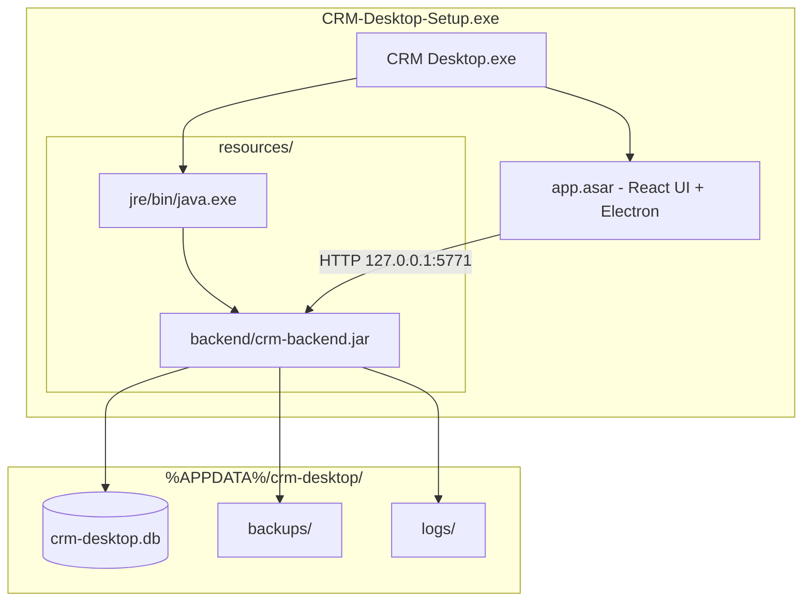

# CRM Desktop

**Standalone customer relationship management software for Windows** — install once, run offline, no Java or database setup required.

[](https://github.com/Adithya726/CRM/releases)
[](https://github.com/Adithya726/CRM/releases)
[](#)

> **Download the installer:** [GitHub Releases](https://github.com/Adithya726/CRM/releases) — get `CRM-Desktop-Setup-x.y.z.exe` from the latest release assets.

---

## Overview

CRM Desktop is a full-stack CRM packaged as a professional Windows desktop application. It combines a modern React interface with a Spring Boot API, embedded **SQLite** database, and a **bundled Java runtime** — delivered through **Electron** and **electron-builder**.

| Mode | Description |
|------|-------------|
| **End users** | Download installer → install → open app |
| **Developers** | Clone repo → build backend + frontend → run or package |

---

## Features

- **Zero-setup installation** — no Java, MySQL, or manual database configuration
- **Offline-first** — SQLite database stored locally in user app data
- **Role-based access** — Admin and Operator workflows
- **Customer & contract management** — CRUD, search, export
- **Complaint lifecycle** — raise, assign engineers, close, reopen
- **Auto backend** — Spring Boot starts hidden when the app opens
- **Automatic backups** — rolling SQLite snapshots in user data folder
- **First-run setup** — default admin account created automatically

---

## Screenshots

_Add PNGs under [`docs/screenshots/`](docs/screenshots/) and embed them here for the GitHub release page._

| Splash | Admin dashboard | Customer management |
|--------|-----------------|---------------------|
| *Coming soon* | *Coming soon* | *Coming soon* |

---

## Architecture



**Startup flow**

1. User launches **CRM Desktop**
2. Electron shows splash screen
3. Bundled JRE runs Spring Boot JAR (`desktop` profile → SQLite)
4. Health check passes → React UI loads
5. On exit → backend process stops gracefully

---

## Technologies

| Layer | Stack |
|-------|--------|
| Desktop shell | [Electron](https://www.electronjs.org/) 35 |
| Frontend | [React](https://react.dev/) 19, [Vite](https://vitejs.dev/) 7, React Router |
| Backend | [Spring Boot](https://spring.io/projects/spring-boot) 3.3, Spring Security, Spring Data JPA |
| Database (desktop) | [SQLite](https://www.sqlite.org/) via Hibernate Community Dialects |
| Database (web dev) | MySQL 8 (optional local dev) |
| Packaging | [electron-builder](https://www.electron.build/) (NSIS installer) |
| Runtime | Eclipse Temurin 17 JRE (bundled) |

---

## Repository structure

```
CRM/
├── CRM_BACKEND/                 # Spring Boot REST API
│   ├── src/main/java/com/crm/
│   └── src/main/resources/
│       ├── application.properties          # Web dev (MySQL)
│       └── application-desktop.properties  # Desktop (SQLite)
│
├── CRM_FRONTEND/                # React + Electron + installer build
│   ├── electron/                # Main process, backend manager, preload
│   ├── resources/
│   │   ├── backend/             # crm-backend.jar (generated, not in git)
│   │   └── jre/                 # Bundled Java (generated, not in git)
│   ├── scripts/                 # build-backend, download-jre, icons
│   ├── build/                   # icon.svg (source); .png/.ico generated
│   ├── src/                     # React application
│   └── release/                 # Installer output (not in git)
│
├── docs/
│   ├── RELEASE.md               # Versioning & GitHub Releases guide
│   └── RELEASE_NOTES_TEMPLATE.md
│
└── README.md
```

---

## Installation (end users)

1. Open **[Releases](https://github.com/Adithya726/CRM/releases)**
2. Download **`CRM-Desktop-Setup-x.y.z.exe`** from the latest release
3. Run the installer (Windows 10/11 x64)
4. Launch **CRM Desktop** from Start Menu or desktop shortcut

**Default login (first launch only)**

| Field | Value |
|-------|--------|
| Username | `admin` |
| Password | `admin123` |

Change the password after first login in production deployments.

**User data location**

```
%APPDATA%\crm-desktop\
  data\crm-desktop.db
  backups\
  logs\
```

---

## Development setup

### Prerequisites

- **Node.js** 20+
- **JDK 17+** (build backend; end users do not need this)
- **Git**

Optional for web-only API dev: **MySQL 8** with database `crm_db`

### Clone and install

```bash
git clone https://github.com/Adithya726/CRM.git
cd CRM/CRM_FRONTEND
npm install
```

### Run desktop app (development)

```bash
cd CRM_FRONTEND
npm run electron
```

This builds the backend JAR and downloads the JRE if missing, then starts Vite + Electron with SQLite in `%APPDATA%/crm-desktop/`.

### Run backend only (MySQL — web dev)

```bash
cd CRM_BACKEND
./mvnw spring-boot:run          # Linux/macOS
mvnw.cmd spring-boot:run        # Windows
```

Uses `application.properties` (MySQL on `localhost:3306/crm_db`).

### Run frontend only (browser)

```bash
cd CRM_FRONTEND
npm run dev
```

Requires API on `http://localhost:5771` (proxy configured in Vite).

---

## Building the Windows installer

From `CRM_FRONTEND`:

```bash
npm run dist
```

**Pipeline (`predist` + build):**

1. `npm run build:backend` — Maven fat JAR → `resources/backend/crm-backend.jar`
2. `npm run download:jre` — Temurin 17 JRE → `resources/jre/`
3. `npm run icons` — generate `build/icon.png` / `icon.ico`
4. Vite production build + electron-builder

**Output**

```
CRM_FRONTEND/release/CRM-Desktop-Setup-1.0.0.exe
```

Do **not** commit `.exe` files to git. Upload them to [GitHub Releases](https://github.com/Adithya726/CRM/releases).

See **[docs/RELEASE.md](docs/RELEASE.md)** for tagging, versioning, and publishing.

---

## Versioning

This project follows **[Semantic Versioning](https://semver.org/)**:

| Tag | When to use |
|-----|-------------|
| `v1.0.1` | Patch — bug fixes, small fixes |
| `v1.1.0` | Minor — new features, backward compatible |
| `v2.0.0` | Major — breaking API/UI or installer changes |

Keep `version` in `CRM_FRONTEND/package.json` aligned with release tags.

---

## Roadmap

- [ ] Code-signed Windows installer (SmartScreen trust)
- [ ] Auto-update via `electron-updater`
- [ ] macOS build (optional)
- [ ] In-app backup/restore UI
- [ ] Custom branding & installer themes
- [ ] CI/CD GitHub Actions for automated releases

---

## Documentation

| Document | Purpose |
|----------|---------|
| [docs/RELEASE.md](docs/RELEASE.md) | GitHub Releases workflow & deployment |
| [docs/RELEASE_NOTES_TEMPLATE.md](docs/RELEASE_NOTES_TEMPLATE.md) | Copy-paste release notes |
| [CRM_FRONTEND/DESKTOP.md](CRM_FRONTEND/DESKTOP.md) | Desktop packaging technical details |

---

## Author

**Adithya** — [github.com/Adithya726](https://github.com/Adithya726)

---

## Support

For bugs and feature requests, use [GitHub Issues](https://github.com/Adithya726/CRM/issues).

For installers and changelog, see [Releases](https://github.com/Adithya726/CRM/releases).
